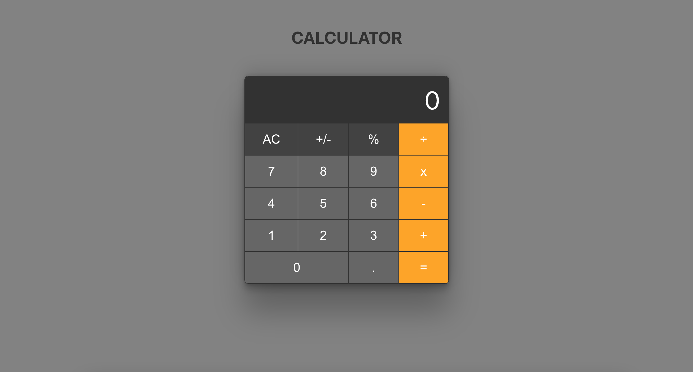

# Calculator

I'm just practicing to improve my React and JS skills.
This is a simple calculator, with basics operations and a macOS look.

The app is made in React (created with Vite), have only 4 components (including App), and a own hook for the operations.

You are free to use under the MIT lisence.
